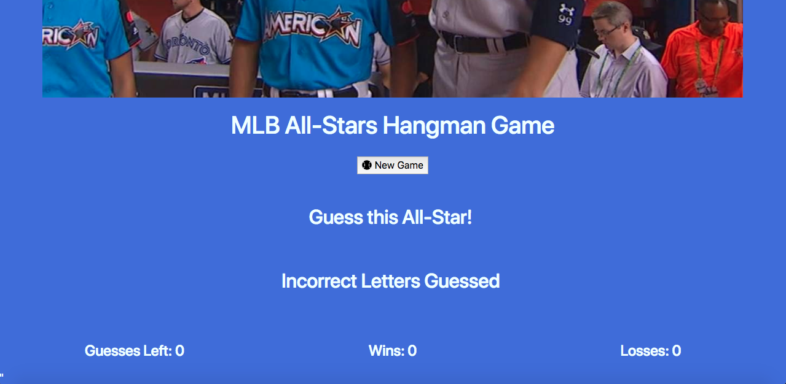
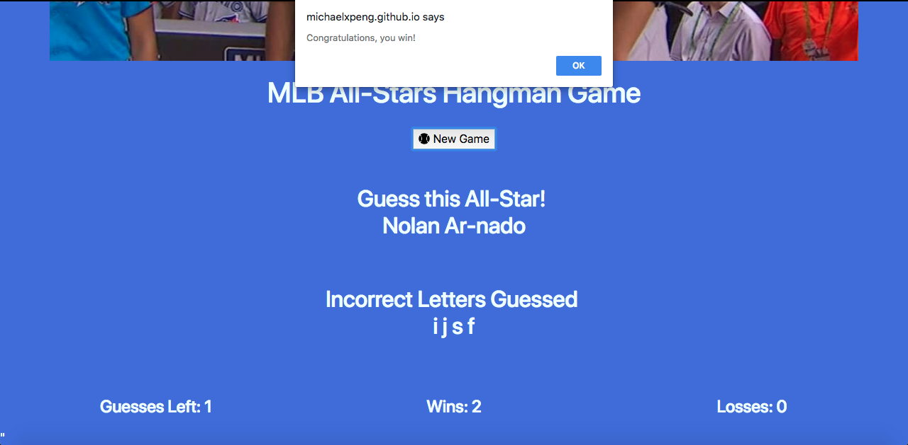

# Word-Guess-Game

## Overview

In this homework assignment for Rutgers Coding Bootcamp, students were asked to create one of two possible computer games: Word Guess or Psychic. These apps will run in the browser, and feature dynamically updated HTML and CSS powered by JavaScript code.

This is the Word Guess version, which is essentially a Hangman game with the theme of 2017 Major League Baseball All-Stars.

## Screenshots

